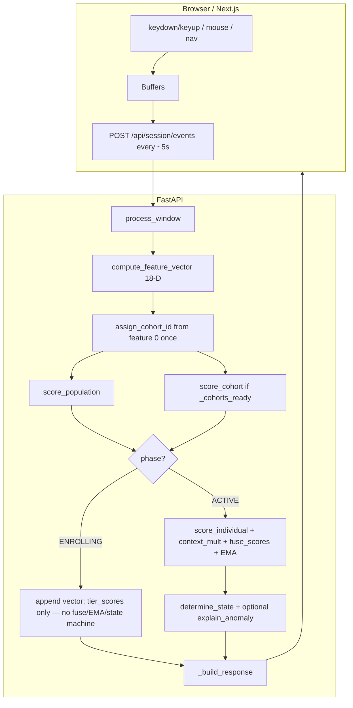

# BehaviorGuard / Imprint: How Detection Works (Implementation Guide)

This document describes **what the running codebase actually does**: raw browser events → 18-D features → **three-tier** scoring (population + cohort + individual) → EMA → **green / yellow / red** with hysteresis, plus optional **Postgres/Supabase** profile persistence and **device fingerprint** context.

---

## 1. What “detection” means here

The system performs **continuous behavioral session risk scoring** (not a labeled “fraud” classifier at inference time). The **core question** at each ~5 s window is: **given this fixed 18-D summary of recent behavior, how “normal” is it under (a) the general population model, (b) the typing-speed cohort’s model, and (c) this account’s own enrollment model — then how do we tighten that judgment when context (transfers, device trust, hour) is risky?**

In order:

1. **Collect** keyboard timing, mouse movement, and navigation events in the browser; flush batches to the API on a fixed interval.
2. **Summarize** each batch into a fixed **18-dimensional** feature vector (only when enough keystroke dwell samples exist in that window).
3. **Assign a cohort once per session** from **mean dwell time** (feature 0): `cohort_00` … `cohort_N` using quantile boundaries from `models/cohort_config.json`.
4. **Score** that vector with:
   - **Population** model (`population_model.pkl` + `population_scaler.pkl`, or a **synthetic Isolation Forest** if pickles are missing),
   - **Optionally** a **per-cohort** model (`cohort_XX_model.pkl` + `cohort_XX_scaler.pkl`) **only if** the full cohort stack loaded at startup (`_cohorts_ready` in `scorer.py`),
   - and after enrollment (or after DB restore), an **individual** Isolation Forest fit on that user’s enrollment windows.
5. **Fuse** the three tier scores with a **`trust_day` schedule** that ramps **individual** weight as the user accumulates **active** scoring windows (this session + prior sessions from DB). **Important:** fusion runs only in **`Phase.ACTIVE`**. During **`Phase.ENROLLING`**, the cohort and population scores are computed for **`tier_scores` / UI** only; they **do not** change `current_score` via fusion.
6. **Apply** a **context multiplier** (transfers, amounts, new beneficiary, off-hours, **unknown device**) to **divide** the fused raw score (higher multiplier → lower effective score → more suspicion).
7. **Smooth** with an **EMA**, then map to **GREEN / YELLOW / RED** via thresholds and an **asymmetric** state machine (fast to worsen, slow to recover).
8. **Return** JSON the frontend uses for banners, modals, live dashboards, and (in the banking UI) conceptual restrictions.

**Source of truth for the session score and state:** the **Python backend** `process_window` in `core/response_engine.py`. The frontend computes **live signals** for UI only; it does not drive the authoritative score.

---

## 2. High-level architecture



**Key files**

| Layer | Role | Main files |
|--------|------|------------|
| Collection | Capture, batch, HTTP | `frontend/hooks/useBehaviorCollector.ts`, `frontend/lib/api.ts` |
| Session + auth | Create session, JWT, hydrate from DB, device fingerprint | `backend/api/session.py`, `backend/api/auth.py`, `backend/core/auth_tokens.py` |
| Session state | In-memory `Session` | `backend/core/session_manager.py` |
| Features | Events → 18-D vector | `backend/core/feature_extractor.py` |
| Models + fusion | Load artifacts, score, fuse, context, EMA | `backend/core/scorer.py` |
| Policy | State machine, actions, RED explanations | `backend/core/response_engine.py` |
| Ingress | Validate batch | `backend/api/events.py` |
| Persistence | Upsert profile, periodic save | `backend/db/profile_store.py`, `backend/db/crud.py` |

---

## 3. When the cohort model is used (exact conditions)

The “cohort model” in code is **one Gaussian Mixture Model (or GMM-class object) per cohort**, loaded from disk as `cohort_XX_model.pkl` with a matching `cohort_XX_scaler.pkl`. Cohort tier is **not** a separate code path from population; it is an **additional score** merged in fusion.

### 3.1 Startup: is cohort scoring enabled at all?

On import, `load_all_models()` in `scorer.py` runs (triggered from `api/session.py`). Cohort scoring is enabled **if and only if**:

1. `models/cohort_config.json` exists and parses (must include `n_cohorts` and `boundaries_ms`).
2. `models/cohort_stats.json` exists and has an entry for **each** `cohort_00` … `cohort_{n-1}` with at least `mean_ll` and `std_ll`.
3. For **each** `i` in `0 .. n_cohorts-1`, **both** `cohort_{i:02d}_model.pkl` and `cohort_{i:02d}_scaler.pkl` exist under `models/`.
4. After loading, `len(_cohort_models) == n_cohorts` and `n_cohorts > 0`.

Then `_cohorts_ready = True`. If any file is missing or counts mismatch, `_cohorts_ready` stays **False**: **`score_cohort` always returns `None`**, and fusion substitutes the **population** score for the cohort term (see §7).

### 3.2 Per session: when is a specific cohort’s `.pkl` used?

For every `process_window` call where `compute_feature_vector` returns a **non-`None`** vector:

1. **Cohort id assignment (once):** If `session.cohort_id` is still `None`, set  
   `session.cohort_id = assign_cohort_id(float(vector[0]))`  
   where `vector[0]` is **mean dwell (ms)**.  
   `assign_cohort_id` walks `cohort_config.json` `boundaries_ms` (length `n_cohorts + 1`) and returns the first `cohort_XX` whose upper bound contains the dwell. If `cohort_config` is empty or malformed, `cohort_id` stays **`None`**.
2. **Scoring call:** `s_coh = score_cohort(vector, session.cohort_id)` is **always invoked** (enrollment and active).
3. **Inside `score_cohort`:**
   - If `cohort_id` is missing, or `_cohorts_ready` is False, or that id is not in `_cohort_models` → return **`None`**.
   - Else: scale the **full 18-D vector** with that cohort’s `StandardScaler`, run **`model.score_samples`** (same API as sklearn GMM: higher values ≈ more likely under that cohort’s training distribution), **z-score** that log-likelihood against `cohort_stats[cid].mean_ll` / `std_ll`, then **`sigmoid(z)`** → **`s_coh` ∈ (0, 1)`**.

So: **you use a cohort model on every scored window after the first assignment**, but only if the **global** cohort stack loaded cleanly at startup **and** the session has a **non-null** `cohort_id`.

### 3.3 Enrollment vs active phase (what changes)

| Phase | `score_cohort` called? | Affects `current_score` via fusion? |
|--------|-------------------------|-------------------------------------|
| **ENROLLING** | Yes (if `_cohorts_ready` and `cohort_id` set) | **No.** Only `last_tier_scores` / API `tier_scores` for dashboards. `current_score` stays at default until ACTIVE (except device bootstrap; see §4). |
| **ACTIVE** | Yes | **Yes.** `fuse_scores(s_pop, s_coh, s_ind, trust_day, context_mult)` → EMA → state machine. |

---

## 4. Session creation, DB hydrate, and device fingerprint

`POST /api/session/create` (`session.py`):

1. Resolves user id from JWT `sub`.
2. Creates in-memory `Session` (`session_manager.py`): default `phase = enrolling`, `current_score = 100`, `device_known = True`, empty vectors.
3. **`_hydrate_session_from_db`:** If a `behavioral_profiles` row exists with `model_blob` + `scaler_blob`, loads individual IF + scaler, `baseline_means`, persisted **`cohort_id`**, **`lifetime_active_windows`**, sets **`phase = active`**, **`current_score = 85`**. If only enrollment checkpoint exists, restores vectors and may restore `cohort_id` from checkpoint.
4. **Device fingerprint (optional body `device_fingerprint`):** If non-empty and DB available and a profile row exists: `device_known = is_known_device(...)`; new devices are **registered** in `known_device_hashes` but **`device_known` remains False** for that session until enrollment completion registers trust. If **no** profile row yet, `device_known` stays **True** (no penalty before first profile). If **`device_is_new` and `profile_loaded`**, **`current_score = 72`** immediately.
5. **`session.device_fingerprint`** and **`session.device_known`** are stored on the session for the whole session.

During **ACTIVE** scoring, `context_risk_multiplier(..., device_known=session.device_known)` applies **`×1.35`** when the device is unknown. After successful enrollment completion + persist, the enrolling device is registered and **`device_known`** set **True** for the remainder of the session.

---

## 5. End-to-end flow (numbered)

### 5.1 Model load (process startup)

See §3.1 for cohort. Population: `population_model.pkl` + `population_scaler.pkl`, or synthetic IF trained once and written to disk.

### 5.2 Event collection (browser)

`useBehaviorCollector`: keystrokes, throttled mouse, navigation. Flush ~**5 s**; skip send if **&lt; 3** keystrokes **and** **&lt; 3** mouse samples.

### 5.3 Server: `POST /api/session/events`

`receive_events` → `process_window` → optional `maybe_periodic_persist`.

### 5.4 Inside `process_window` (single source of truth)

**Step A — Window counter**  
`session.window_count += 1`.

**Step B — Feature vector**  
`vector = compute_feature_vector(...)` with `historical_nav=session.nav_history`, `session_elapsed_min=session.elapsed_minutes()`.  
If **`vector is None`** (e.g. `len(dwells) < 3` in that window): return immediately; **score and state unchanged**.

**Step C — Navigation history**  
Append `to` from each nav event; keep last **20** strings (feeds **nav_similarity** next windows).

**Step D — Cohort assignment (once)**  
If `session.cohort_id is None`: `session.cohort_id = assign_cohort_id(float(vector[0]))`.

**Step E — Tier scores (always when vector exists)**  
- `s_pop = score_population(vector)` → always a float in **[0, 1]** (or fallback **0.8** if population artifacts missing).  
- `s_coh = score_cohort(vector, session.cohort_id)` → **float in (0,1)** or **`None`**.

**Step F — Branch on `session.phase`**

*If **ENROLLING**:*

1. `session.enrollment_vectors.append(vector.tolist())`.
2. `trust_day = trust_day_for_total_active(0, enrolling=True)` → **always `1`** (schedule row that gives **0% individual weight** in fusion — but fusion is not run here anyway).
3. `last_tier_scores` = population, cohort or null, individual null, `trust_day`, `cohort_id`.
4. If `len(enrollment_vectors) >= enrollment_target` (default **8**): train individual IF + scaler on those rows; set `baseline_means`; `phase = ACTIVE`; persist profile; register device fingerprint in DB; **`return _build_response`** (no EMA fusion on this same call).

*If **ACTIVE**:*

1. `session.active_scoring_windows += 1`.
2. `total_active = session.lifetime_windows_prior + session.active_scoring_windows`.
3. `trust_day = trust_day_for_total_active(total_active, enrolling=False)` → **2, 4, 6, or 7** from lifetime active window count buckets.
4. `s_ind = score_individual(session.model, session.scaler, vector)` if model exists, else **`None`**.
5. `ctx_mult = context_risk_multiplier(action, amount, is_new_beneficiary, hour, device_known)`.
6. `raw_score = fuse_scores(s_pop, s_coh, s_ind, trust_day, context_mult=ctx_mult)` → **0–100** before EMA.
7. `session.current_score = apply_ema(current_score, raw_score, alpha=0.3)`.
8. `determine_state` + optional **`explain_anomaly`** on RED vs `baseline_means`.

This is the full chain that implements **“different pattern from current user”**: **individual IF** directly compares the window to **that user’s enrollment distribution**; **population** and **cohort** provide **broader** baselines so cold-start and cross-user drift are still visible in `tier_scores` and in fusion weights before individual dominates.

---

## 6. Feature vector (18 dimensions)

Computed in `compute_feature_vector` (`feature_extractor.py`). Returns **`None`** unless **`len(dwells) >= 3`**.

| Index | Concept | Meaning |
|------|---------|--------|
| 0–1 | mean/std **dwell** | Keydown→keyup hold times (ms), **20–500 ms** kept |
| 2–3 | mean/std **flight** | Previous keyup → next keydown, **0–800 ms** |
| 4–5 | mean/std **digraph** | Consecutive keydown-to-keydown, **20–1000 ms** |
| 6 | **entropy** | Shannon entropy of dwell histogram (**30 bins**, **0–300 ms** range) |
| 7 | **error_rate** | Backspace keydowns / total keydowns |
| 8–9 | mean/std **mouse velocity** | √(dx²+dy²)/dt; drops samples with **v ≥ 10** px/ms |
| 10–11 | mean/std **page dwell** | Seconds between nav timestamps (**&lt; 300 s** per step) |
| 12 | **nav_similarity** | **1 − normalized Levenshtein** between this window’s `to` paths and **`historical_nav`** |
| 13–14 | **counts** | Dwell samples, velocity samples |
| 15 | **session_elapsed_min** | Wall time since `Session.created_at` |
| 16–17 | **ratios** | dwell/digraph mean ratio; digraph CV (std/mean) |

**Cohort assignment uses only index 0** at assignment time; **cohort scoring uses the full 18-D vector** after scaling.

Debug / explanation names: **`FEATURE_NAMES`** in `response_engine.py`.

---

## 7. Models, fusion, and smoothing

### 7.1 Population tier

- **Isolation Forest:** `StandardScaler.transform` → **`score_samples`** →  
  **`clip((raw + 0.6) / 0.55, 0, 1)`** (see `score_population` — **not** the older 0.7/0.6 constants used for individual).
- **OneClassSVM:** same scaling → raw decision → **`sigmoid(raw * 3)`** into **[0, 1]**.

### 7.2 Cohort tier (GMM / `score_samples`)

- Per-cohort scaler on **18-D** → **`model.score_samples`** → scalar log-likelihood-style score **`ll`**.
- **`z = (ll - mean_ll) / std_ll`** from `cohort_stats.json`.
- **`s_coh = sigmoid(z)`**.
- If cohort unavailable: **`s_coh is None`** → in `fuse_scores`, **`s_coh_use = s_pop`** (cohort weight still applied, but to the population value — so missing cohort artifacts **do not zero** the cohort weight slot).

### 7.3 Individual tier

- **`train_individual_model`:** IF + scaler on enrollment matrix; `contamination = max(0.02, 0.10 - session_count * 0.01)` (call site passes **`session_count=0`** today → **0.10**).
- **`score_individual`:** **`clip((raw + 0.7) / 0.6, 0, 1)`** on IF `score_samples`.

### 7.4 Three-tier fusion → 0–100

**`get_three_tier_weights(trust_day)`** uses **`WEIGHT_SCHEDULE`** in `scorer.py` (first matching row from the bottom where `trust_day >= threshold`):

| `trust_day` ≥ | `w_pop` | `w_cohort` | `w_individual` |
|---------------|---------|------------|----------------|
| 7 | 0.10 | 0.20 | 0.70 |
| 6 | 0.15 | 0.30 | 0.55 |
| 4 | 0.25 | 0.40 | 0.35 |
| 2 | 0.35 | 0.50 | 0.15 |
| 1 | 0.40 | 0.60 | 0.00 |

**`trust_day` values produced by `trust_day_for_total_active`:**

- **Enrolling (fusion not used for score):** forced **`1`**.
- **Active:** **`total_lifetime_active_windows`** = `lifetime_windows_prior` + `active_scoring_windows`:  
  **&lt; 5 → 2**, **&lt; 15 → 4**, **&lt; 30 → 6**, else **7**.

**Redistribution:**

- If **`s_ind is None`:** individual weight set to **0**; **`w_pop`, `w_cohort` renormalized** to sum to 1.
- **`raw = w_pop * s_pop + w_cohort * s_coh_use + w_individual * s_ind`** (with `s_coh_use` from §7.2).
- **`adjusted = raw / context_mult`** (larger multiplier → **lower** fused value before scaling to 0–100).
- **Return:** **`clip(adjusted * 100, 0, 100)`**.

### 7.5 EMA

**`apply_ema(current, new, alpha=0.3)`** → **`0.3 * new + 0.7 * current`**.

---

## 8. Risk context (server-side)

**`context_risk_multiplier`** (`scorer.py`), applied only in **ACTIVE** `process_window`:

- **`device_known == False`:** **`×1.35`**.
- **`action == "transfer"`:** extra multipliers for **amount &gt; 50_000**, **&gt; 200_000**, and **`is_new_beneficiary`**.
- **Hour outside 8–22:** **`×1.2`**.

Wire **`context`** on **`EventBatch`** from the frontend when the user performs sensitive actions.

---

## 9. Thresholds and state machine

### 9.1 Bands (`response_engine.py`)

| Condition | Candidate state |
|-----------|-----------------|
| score ≥ **55** | GREEN |
| score ≥ **28** | YELLOW |
| else | RED |

### 9.2 Asymmetric transitions (`determine_state`)

- **Worsening:** RED can apply **immediately**; YELLOW needs recent non-green history when slipping from green.
- **Recovery:** **3** consecutive windows for RED→YELLOW, **4** for YELLOW→GREEN, **5** for RED→GREEN.

State history capped at **10** entries.

---

## 10. Actions and UI mapping

**`get_action(state)`** returns **`action`**, **`restrict`**, **`ui`**: GREEN none; YELLOW soft alert; RED step-up modal metadata. The **banking UI** interprets these.

---

## 11. Explainability (RED only)

**`explain_anomaly`** compares the current vector to **`baseline_means`** (enrollment means), skips noisy dimensions, returns top **two** readable deviations. If no baseline → generic copy.

---

## 12. Persistence and session end

- **`persist_bg_session_profile`** writes model, scaler, baseline_means, **cohort_id**, **lifetime_active_windows**, and device hashes policy via separate CRUD.
- **`POST /api/session/{session_id}/end`:** persist if eligible, delete in-memory session.
- **`DELETE /api/auth/profile`:** full behavioral row deletion including device hashes (DPDPA path).

**Limitation:** In-memory sessions are **lost on server restart** unless profiles were saved and reloaded on next **`session/create`**.

---

## 13. Other API surfaces (reference)

| Method | Path | Purpose |
|--------|------|---------|
| POST | `/api/session/create` | New session; DB hydrate; `device_known` in response |
| GET | `/api/session/{session_id}` | Poll score, phase, state, `tier_scores`, etc. |
| POST | `/api/session/events` | Behavioral batch → scoring response |
| POST | `/api/session/feedback` | Legitimacy confirmation / soft reset |
| POST | `/api/session/{session_id}/end` | Persist + remove session |
| DELETE | `/api/auth/profile` | Delete behavioral profile + server device hashes (JWT) |
| GET | `/api/admin/sessions` | List active in-memory sessions |
| WS | `/ws/{session_id}` | Periodic score/state snapshot (no `tier_scores` in payload) |
| — | `/api/auth/*` | Register/login JWT when DB auth enabled |

**Health:** `GET /health` includes DB connectivity when configured.

---

## 14. Frontend checklist

1. Set **`NEXT_PUBLIC_API_URL`** to the API base **including `/api`**.
2. After login/register: **`createSession`** with JWT; pass **`deviceFingerprint`** when consent allows.
3. Attach listeners; **`flush`** ~**5 s** with monotonic timestamps.
4. On **RED**, show **`explanation`**.
5. **`injectImpostorEvents`** posts synthetic slow keystrokes through the same pipeline for demos.

---

## 15. Production-oriented limitations

- **Population / cohort** artifacts must match your **real** feature distribution; synthetic population is a **placeholder**.
- **Keystroke timing** is sensitive personal data: align with **DPDPA / RBI / GDPR** as applicable.
- **Risk scoring**, not cryptographic identity: combine with **MFA**, device trust, and fraud rules.
- **`train_individual_model(..., session_count=0)`** fixes contamination ramp unless you thread a real per-user session count.

---

## 16. Quick reference — `POST /api/session/events` body

```json
{
  "session_id": "uuid",
  "window_id": 1,
  "keystrokes": [{ "type": "keydown|keyup", "key": "...", "timestamp": 0 }],
  "mouse": [{ "x": 0, "y": 0, "timestamp": 0 }],
  "navigation": [{ "from_page": "", "to": "/path", "timestamp": 0 }],
  "context": {
    "action": "browse",
    "amount": 0,
    "is_new_beneficiary": false
  }
}
```

**Response (subset):** `score`, `state`, `phase`, `enrollment_progress`, `window_count`, `cohort_id`, `action`, `restrict`, `ui`, `explanation?`, **`tier_scores`**.

---

Update this file whenever you change **feature order**, **fusion weights**, **population IF mapping**, **thresholds**, **flush interval**, **device logic**, or **persistence** so it stays aligned with the code.
