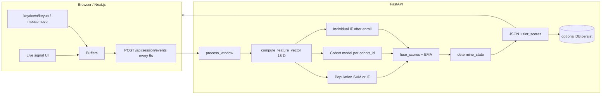

# BehaviorGuard / Imprint: How Detection Works (Implementation Guide)

This document describes **what the running codebase actually does**: raw browser events → 18-D features → **three-tier** scoring (population + cohort + individual) → EMA → **green / yellow / red** with hysteresis, plus optional **Postgres/Supabase** profile persistence.

---

## 1. What “detection” means here

The system performs **continuous behavioral session risk scoring** (not a labeled “fraud” classifier at inference time). In order:

1. **Collect** keyboard timing, mouse movement, and navigation events in the browser; flush batches to the API on a fixed interval.
2. **Summarize** each batch into a fixed **18-dimensional** feature vector (when enough keystroke dwell samples exist).
3. **Score** that vector with:
   - a **population** model (trained artifact from disk, or **Isolation Forest** on synthetic data if pickles are missing),
   - optionally a **cohort** model (per-cohort artifacts from the ML notebook, keyed by mean dwell time),
   - and after enrollment (or after DB restore), an **individual** Isolation Forest fit on that user’s enrollment windows.
4. **Fuse** the three tier scores with a **trust schedule** that ramps **individual** weight as the user accumulates **active** scoring windows (this session + prior sessions from DB).
5. **Apply** a **context multiplier** (transfers, amounts, new beneficiary, off-hours) to tighten scoring on sensitive actions.
6. **Smooth** with an **EMA**, then map to **GREEN / YELLOW / RED** via thresholds and an **asymmetric** state machine (fast to worsen, slow to recover).
7. **Return** JSON the frontend uses for banners, modals, live dashboards, and (in the banking UI) conceptual restrictions.

**Source of truth for the session score and state:** the **Python backend** `process_window` in `core/response_engine.py`. The frontend computes **live signals** for UI only; it does not drive the authoritative score.

---

## 2. High-level architecture



**Key files**

| Layer | Role | Main files |
|--------|------|------------|
| Collection | Capture, batch, HTTP | `frontend/hooks/useBehaviorCollector.ts`, `frontend/lib/api.ts` |
| Session + auth | Create session, JWT only, hydrate from DB | `backend/api/session.py`, `backend/api/auth.py`, `backend/core/auth_tokens.py` |
| Session state | In-memory `Session` | `backend/core/session_manager.py` |
| Features | Events → 18-D vector | `backend/core/feature_extractor.py` |
| Models + fusion | Load artifacts, score, fuse, context, EMA | `backend/core/scorer.py` |
| Policy | State machine, actions, RED explanations | `backend/core/response_engine.py` |
| Ingress | Validate batch | `backend/api/events.py` |
| Persistence | Upsert profile, periodic save | `backend/db/profile_store.py`, `backend/db/crud.py` |

---

## 3. End-to-end flow

### 3.1 Model load (process startup)

Importing `api/session.py` calls **`load_all_models()`** (`scorer.py`):

- Loads **`models/population_model.pkl`** + **`population_scaler.pkl`** if present. The population estimator may be **`IsolationForest`** or **`OneClassSVM`** (from the training notebook). SVM raw scores are mapped through a **sigmoid**; IF uses the existing linear normalization (see §5).
- If population pickles are missing, trains a **synthetic Isolation Forest**, saves pickles, and uses that.
- If **`cohort_config.json`** and **`cohort_stats.json`** exist and all **`cohort_XX_model.pkl` / `cohort_XX_scaler.pkl`** pairs are present, **cohort scoring** is enabled; otherwise the cohort tier is skipped and fusion falls back to population for that term.

### 3.2 Session creation (`POST /api/session/create`)

1. **User identity:** **`Authorization: Bearer <JWT>`** only (`sub` = user id from register/login). Missing or invalid token → **401**.
2. A new in-memory **`Session`** is created (`session_manager.py`): UUID `session_id`, phase **`enrolling`**, state **`green`**, `current_score = 100`, empty enrollment buffers, `nav_history`, `cohort_id = None`, `active_scoring_windows = 0`, `lifetime_windows_prior = 0`.
3. **Database hydrate (optional):** If **`DATABASE_URL`** is valid and a row exists in **`behavioral_profiles`** for that user, **`joblib`-serialized** individual **model**, **scaler**, **baseline_means**, **cohort_id**, and **`lifetime_active_windows`** are loaded. The session becomes **`phase = active`** immediately, **`current_score = 85`**, and **enrollment is skipped** for this session.
4. Response includes **`profile_loaded`**, **`cohort_id`**, **`database`** flag, and a human-readable **`message`**.

### 3.3 Event collection (browser)

`useBehaviorCollector` (when `sessionId` is set):

- **`keydown` / `keyup`:** `{ type, key, timestamp }` with **`performance.now()`** (ms).
- **`mousemove`:** throttled to **≥ 50 ms** between samples; `{ x, y, timestamp }` in viewport coordinates.
- **`trackNavigation(from, to)`:** appends nav events with `from_page`, `to`, `timestamp`.

Every **5 seconds**, **`flush`** runs:

- If **fewer than 3 keystrokes** and **fewer than 3 mouse samples**, the batch is **not** sent.
- Otherwise: client computes **live signals** for the store/UI, then **`POST /api/session/events`** with `session_id`, incrementing `window_id`, and the arrays.

**Context:** The default payload **omits** `context`; the backend uses **`action: "browse"`** and defaults for amount / beneficiary. The banking transfer flow can attach **`context`** matching **`Context`** in `api/events.py` for stricter multipliers (see §6).

### 3.4 Server handling (`POST /api/session/events`)

`receive_events` (`api/events.py`):

1. Resolves **`Session`** by `session_id` (404 if missing).
2. Converts Pydantic models to dicts; builds **`context`** dict.
3. Calls **`process_window(...)`**.
4. Calls **`maybe_periodic_persist(session)`**: when DB is available and the session is **active** with a trained model, persists on **first active window** and **every 4 active windows** (`profile_store.py`).

### 3.5 Inside `process_window` (`response_engine.py`)

1. **`session.window_count += 1`**
2. **`compute_feature_vector(...)`** with `historical_nav=session.nav_history` and **`session_elapsed_min`** from `Session.elapsed_minutes()`.
3. If the vector is **`None`** (**`len(dwells) < 3`** in that window), the handler returns **`_build_response`** without changing score/state (score stays as-is).
4. **Nav history:** each event’s **`to`** is appended; list trimmed to **last 20** paths (used for **nav similarity** on later windows).
5. **Cohort assignment:** if **`session.cohort_id` is still `None`**, set it with **`assign_cohort_id(float(vector[0]))`** using **`cohort_config.json`** quantile boundaries on **mean dwell (feature 0)**.
6. Always compute **`s_pop = score_population(vector)`** and **`s_coh = score_cohort(vector, session.cohort_id)`** (cohort may be **`None`** if artifacts missing).

**Enrollment (`phase == enrolling`):**

- Append **`vector`** to **`enrollment_vectors`**.
- Set **`last_tier_scores`** (population, cohort or null, individual null, **`trust_day`** from **`trust_day_for_total_active(..., enrolling=True)`** → **1**, plus **`cohort_id`**).
- When **`len(enrollment_vectors) >= enrollment_target`** (default **8**):
  - **`train_individual_model`** → `session.model`, `session.scaler`
  - **`baseline_means`** = row-wise mean of enrollment matrices (for RED explanations)
  - **`phase = active`**
- Returns **without** running active-phase EMA/state on that same call (response reflects new phase/progress).

**Active phase:**

- **`session.active_scoring_windows += 1`**
- **`total_active = session.lifetime_windows_prior + session.active_scoring_windows`**
- **`trust_day = trust_day_for_total_active(total_active, enrolling=False)`** — drives **`WEIGHT_SCHEDULE`** in **`fuse_scores`** (see §5).
- **`s_ind = score_individual(...)`** if `session.model` exists, else **`None`** (fusion redistributes weight).
- **`ctx_mult = context_risk_multiplier(...)`** from context + **server local hour**.
- **`raw_score = fuse_scores(s_pop, s_coh, s_ind, trust_day, context_mult=ctx_mult)`**
- **`session.current_score = apply_ema(current_score, raw_score, alpha=0.3)`**
- **`determine_state`**, **`add_state`**, optional **`explain_anomaly`** on **RED**
- Response includes **`tier_scores`**: population, cohort, individual, **`trust_day`**, **`cohort_id`**

### 3.6 Client handling

- Store **`updateScore`** with score, state, phase, enrollment progress, **`cohortId`**, **`tierScores`**, etc.
- On **RED** + **`explanation`**, **`setOverlay`** shows the security modal.
- After the first **`phase === 'active'`** response, client may snapshot computed signal values as a **local baseline** for dashboard deviation coloring (not used for server score).

---

## 4. Feature vector (18 dimensions)

Computed in **`compute_feature_vector`** (`feature_extractor.py`). Returns **`None`** unless **`len(dwells) >= 3`**.

| Index | Internal / concept | Meaning |
|------|---------------------|--------|
| 0–1 | mean/std **dwell** | Keydown→keyup hold times (ms), **20–500 ms** kept |
| 2–3 | mean/std **flight** | Previous keyup → next keydown, **0–800 ms** |
| 4–5 | mean/std **digraph** | Consecutive keydown-to-keydown, **20–1000 ms** |
| 6 | **entropy** | Shannon entropy of dwell histogram (**30 bins**, **0–300 ms** range) |
| 7 | **error_rate** | Backspace keydowns / total keydowns |
| 8–9 | mean/std **mouse velocity** | √(dx²+dy²)/dt between moves; drops samples with **v ≥ 10** px/ms |
| 10–11 | mean/std **page dwell** | Seconds between nav timestamps (**< 300 s** per step); nav `timestamp` is ms |
| 12 | **nav_similarity** | **1 − normalized Levenshtein** between this window’s `to` paths and **`historical_nav`** |
| 13–14 | **counts** | Number of dwell samples, number of velocity samples |
| 15 | **session_elapsed_min** | Wall time since `Session.created_at` |
| 16–17 | **ratios** | dwell/digraph mean ratio; digraph CV (std/mean) |

Debug / explanation names: **`FEATURE_NAMES`** in `response_engine.py`.

---

## 5. Models, fusion, and smoothing

### 5.1 Population tier

- **Isolation Forest:** `StandardScaler.transform` → **`score_samples`** → normalized with  
  **`clip((raw + 0.7) / 0.6, 0, 1)`** (higher ≈ more “normal” vs training).
- **OneClassSVM:** same scaling → raw decision → **`sigmoid(raw * 3)`** into **[0, 1]**.

### 5.2 Cohort tier

- If cohort artifacts are loaded and **`cohort_id`** is assigned, **`score_cohort`** scales the vector with the cohort’s scaler, takes **`score_samples`** (log-likelihood style for GMM-style exports from the notebook), **z-scores** against **`cohort_stats[cid].mean_ll` / `std_ll`**, then **`sigmoid(z)`**.
- If cohort scoring is unavailable, **`fuse_scores`** substitutes **`s_pop`** for the cohort term.

### 5.3 Individual tier (after enrollment or not loaded from DB)

- **`train_individual_model`:** `IsolationForest` + `StandardScaler` on enrollment rows; **`contamination = max(0.02, 0.10 - session_count * 0.01)`** (currently **`session_count=0`** at call site → **0.10** unless changed).
- **`score_individual`:** same normalization as population IF branch.

### 5.4 Three-tier fusion → 0–100

**`get_three_tier_weights(trust_day)`** (`WEIGHT_SCHEDULE` in `scorer.py`): maps **`trust_day`** to **`(w_pop, w_cohort, w_individual)`**. If **`s_ind` is `None`**, individual weight is **redistributed** to population + cohort. If **`s_coh` is `None`**, cohort term uses **`s_pop`**.

**`raw = w_pop * s_pop + w_cohort * s_cohort_effective + w_individual * s_ind_effective`**

**`adjusted = raw / context_mult`** (higher-risk context lowers the effective score).

**Return:** **`clip(adjusted * 100, 0, 100)`**.

### 5.5 `trust_day` (not a calendar day)

**`trust_day_for_total_active(total_lifetime_active_windows, enrolling)`:**

- **Enrolling:** **`trust_day = 1`** (schedule favors population + cohort; no individual in fusion).
- **Active:** derived from **`total_lifetime_active_windows`** = **`lifetime_windows_prior`** (from DB) **+** **`active_scoring_windows`** (this session):  
  **&lt; 5 → 2**, **&lt; 15 → 4**, **&lt; 30 → 6**, else **7**, matching the notebook-style ramp.

This replaces the older doc note about a hardcoded **`weight_day = 1`** for 70/30 fusion; the live path is **three-tier + `trust_day`**.

### 5.6 EMA

**`apply_ema(current, new, alpha=0.3)`** → **`0.3 * new + 0.7 * current`**.

---

## 6. Risk context (server-side)

**`context_risk_multiplier`** (`scorer.py`):

- **`action == "transfer"`:** extra multiplier for **amount &gt; 50_000**, again for **&gt; 200_000**, and for **`is_new_beneficiary`**.
- **Hour outside 8–22:** **×1.2**.

Wire **`context`** on **`EventBatch`** from the frontend when the user performs sensitive actions.

---

## 7. Thresholds and state machine

### 7.1 Bands (`response_engine.py`)

| Condition | Candidate state |
|-----------|-----------------|
| score ≥ **55** | GREEN |
| score ≥ **28** | YELLOW |
| else | RED |

### 7.2 Asymmetric transitions (`determine_state`)

- **Worsening:** RED can apply **immediately**; YELLOW needs recent non-green history when slipping from green.
- **Recovery:** **3** consecutive windows for RED→YELLOW, **4** for YELLOW→GREEN, **5** for RED→GREEN (see code for exact pairing).

State history capped at **10** entries.

---

## 8. Actions and UI mapping

**`get_action(state)`** returns **`action`**, **`restrict`**, **`ui`**:

- **GREEN:** `none`, no UI payload.
- **YELLOW:** `soft_alert`, `transfer_above_50k`, dismissible banner metadata.
- **RED:** `step_up_auth`, stronger `restrict` list, non-dismissible modal metadata.

The **banking UI** interprets these; the API only **declares** policy hints.

---

## 9. Explainability (RED only)

**`explain_anomaly`** compares the current vector to **`baseline_means`**, skips noisy dimensions (counts, elapsed), sorts by **percent deviation**, returns top **two** readable messages plus advice. If no baseline → generic copy.

---

## 10. Persistence and session end

- **`persist_bg_session_profile`** writes **model**, **scaler**, **baseline_means**, **cohort_id**, and **`lifetime_active_windows`** (total active windows) to **`behavioral_profiles`** when DB is configured (`profile_store.py` + `crud`).
- **`POST /api/session/{session_id}/end`:** persists profile (if eligible), returns summary, **deletes** in-memory session.
- **`POST /api/session/feedback`** with **`was_legitimate: true`:** resets score to **70**, clears score/state history, sets **GREEN**, increments a DB confirmation counter when DB is on, and **persists** profile. **Not** a full model retrain.

**Limitation:** In-memory sessions are still **lost on server restart** unless profiles were saved and reloaded on next **`session/create`**.

---

## 11. Other API surfaces (reference)

| Method | Path | Purpose |
|--------|------|---------|
| POST | `/api/session/create` | New session; optional DB hydrate |
| GET | `/api/session/{session_id}` | Poll score, phase, state, `tier_scores`, etc. |
| POST | `/api/session/events` | Behavioral batch → scoring response |
| POST | `/api/session/feedback` | Legitimacy confirmation / soft reset |
| POST | `/api/session/{session_id}/end` | Persist + remove session |
| GET | `/api/admin/sessions` | List active in-memory sessions (console) |
| WS | `/ws/{session_id}` | Every **3 s**: score, state, phase, `window_count` (no `tier_scores` in payload) |
| — | `/api/auth/*` | Register/login JWT when DB auth enabled |

**Health:** `GET /health` includes DB connectivity when configured.

---

## 12. Frontend checklist

1. Set **`NEXT_PUBLIC_API_URL`** to the API base **including `/api`**, e.g. `http://localhost:8000/api` (`frontend/lib/api.ts`).
2. After login/register: **`createSession`** with JWT in `Authorization`.
3. Attach listeners; **`flush`** every **5 s** with monotonic timestamps.
4. On **RED**, show **`explanation`**.
5. **`injectImpostorEvents`** (`lib/api.ts`) posts synthetic slow keystrokes through the **same** events path for testing / presentations.

---

## 13. Production-oriented limitations

- **Sessions** are primarily **in-memory**; durability depends on **DB profile** + **`/end`** / periodic persist.
- **Population / cohort** artifacts should match your **real** feature distribution; synthetic population is a **placeholder**.
- **Keystroke timing** is sensitive personal data: disclose, minimize retention, align with **DPDPA / RBI / GDPR** as applicable.
- This stack is **risk scoring**, not cryptographic identity proof: combine with **MFA**, device trust, and fraud rules.
- **`train_individual_model(..., session_count=0)`** fixes contamination ramp unless you thread a real per-user session count.

---

## 14. Quick reference — `POST /api/session/events` body

```json
{
  "session_id": "uuid",
  "window_id": 1,
  "keystrokes": [{ "type": "keydown|keyup", "key": "...", "timestamp": 0 }],
  "mouse": [{ "x": 0, "y": 0, "timestamp": 0 }],
  "navigation": [{ "from_page": "", "to": "/path", "timestamp": 0 }],
  "context": {
    "action": "browse",
    "amount": 0,
    "is_new_beneficiary": false
  }
}
```

**Response (subset):** `score`, `state`, `phase`, `enrollment_progress`, `window_count`, `cohort_id`, `action`, `restrict`, `ui`, `explanation?`, **`tier_scores`**.

---

Update this file whenever you change **feature order**, **fusion**, **thresholds**, **flush interval**, or **persistence** behavior so it stays aligned with the code.
